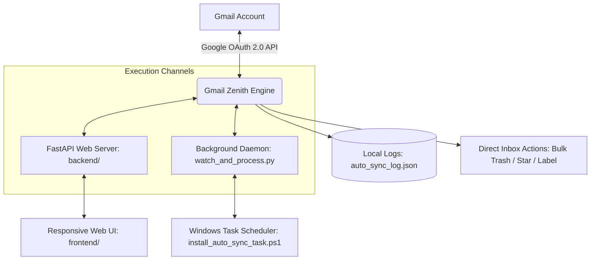

# ✉️ Gmail Zenith Pro

<div align="center">

[](LICENSE)
[](https://fastapi.tiangolo.com/)
[](https://github.com/Kamran5H/GmailZenith)
[](https://developers.google.com/gmail/api)
[](https://github.com/Kamran5H/GmailZenith)

**High-velocity email automation suite and bulk triage engine powered by FastAPI, Google OAuth2, and automated background sync daemons.**

[Features](#-features) • [Architecture](#-architecture) • [Installation](#-installation) • [Configuration](#-configuration) • [License](#-license)

</div>

---

## 🌟 Executive Overview

**Gmail Zenith Pro** is an autonomous email triage and inbox automation platform built on the official **Google Gmail REST API**. Built for professionals overwhelmed by subscription noise, marketing blasts, and cold outreach, Gmail Zenith Pro enables automated rule execution, bulk label triage, thread batching, and silent background synchronization without relying on third-party SaaS cloud aggregators.

---

## 🚀 Features

- **⚡ Official Google OAuth 2.0 Security**: Direct authentication via Google Cloud Console credentials with zero middleman servers. Tokens refresh automatically and securely in local storage.
- **📨 Bulk Triage & Thread Archiving**: Filter, categorize, label, or trash thousands of promotional emails, automated system notifications, and unread threads in seconds.
- **🔄 Silent Background Auto-Sync (`watch_and_process.py`)**: Runs as a lightweight Windows scheduled task or background daemon, applying user-defined triage rules periodically.
- **🎨 Interactive Modern Dashboard**: Clean FastAPI backend serving a responsive web console to audit incoming messages, execute manual triage runs, and view live processing logs.
- **📊 Real-Time Analytics & Audit Log**: Tracks all processed, archived, and deleted messages in `auto_sync_log.json` for full accountability and reversible actions.
- **🖥️ Windows Task Scheduler Automation**: Includes turnkey PowerShell installer (`install_auto_sync_task.ps1`) to set up an automated background service in one click.

---

## 🏗️ Architecture



---

## 📁 Repository Structure

```text
GmailZenith/
├── backend/                    # FastAPI backend server & Gmail API controllers
├── frontend/                   # Modern responsive web dashboard
├── scan_primary_inbox.py       # Primary inbox scanner & message classifier
├── watch_and_process.py        # Background watcher daemon applying rules
├── run_gmail_zenith.bat        # Windows one-click web dashboard launcher
├── launch_auto_sync.vbs        # Silent VBScript background launcher
├── install_auto_sync_task.ps1  # Automated Windows Task Scheduler registrar
├── auto_sync_log.json          # Audit trail of automated actions taken
├── gmail_zenith.ico            # Application icon
├── .gitignore                  # OAuth credentials, tokens & log exclusions
└── LICENSE                     # Open-source MIT License
```

---

## ⚡ Installation

### Prerequisites
- Python 3.10 or higher
- A Google Cloud Project with the **Gmail API** enabled and an OAuth2 Client ID (`credentials.json`).

### Setup
```bash
git clone https://github.com/Kamran5H/GmailZenith.git
cd GmailZenith

# Setup virtual environment
python -m venv .venv
.venv\Scripts\activate

# Install requirements
pip install fastapi uvicorn google-api-python-client google-auth-httplib2 google-auth-oauthlib
```

### Authentication
1. Place your `credentials.json` file in the root directory.
2. Run the application:
   ```bash
   python backend/main.py
   ```
3. Complete the Google OAuth authentication prompt in your browser. Tokens will be saved locally.

---

## 📜 License

This project is open-source and released under the [MIT License](LICENSE).  
Copyright (c) 2024-2026 **Kamran Ashraf**.
